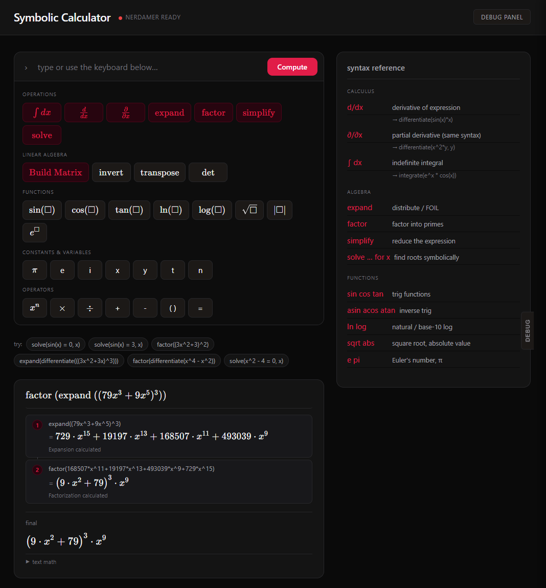
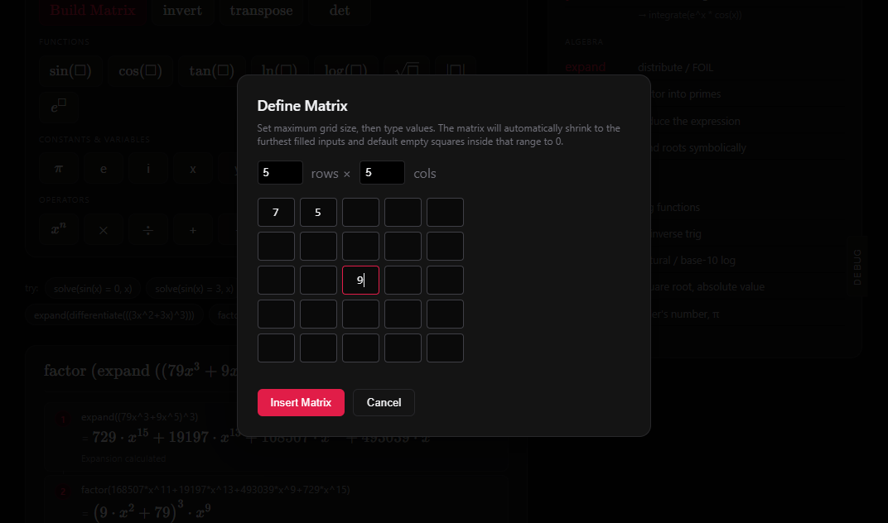
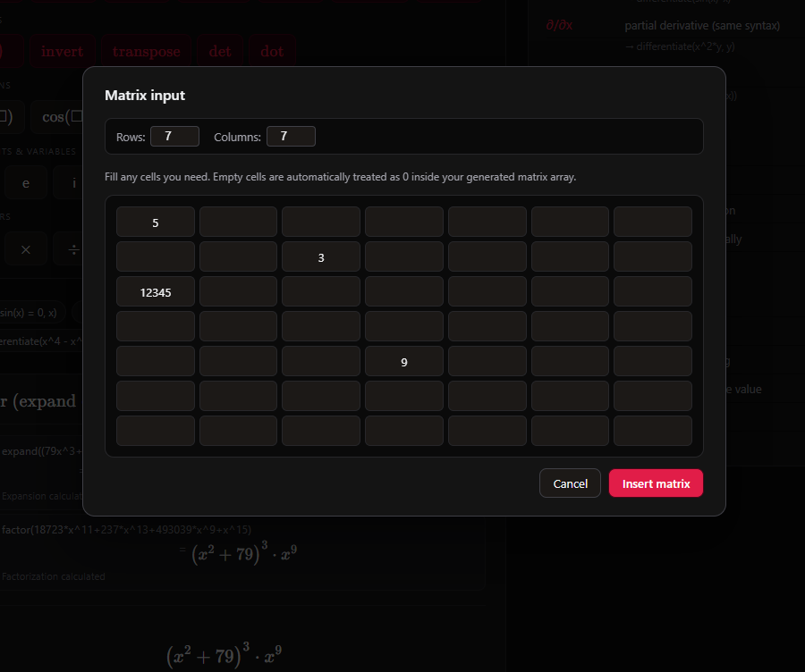
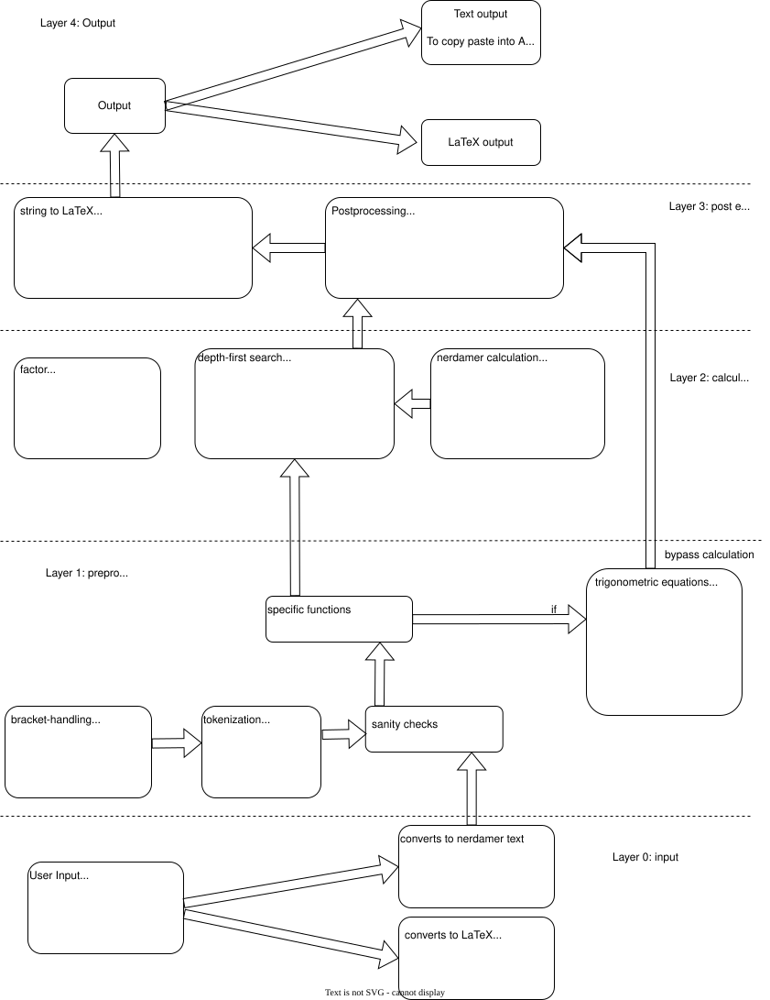

This is Universal calculator; a symbolic calculator designed entirely on the client side of any user.

This calculator has the capacity to replace paid-for pedagogical mathematical services students pay for, the aim of this project is to make a symbolic calculator requiring no operational cost nor costs for students.

link: https://kulsrepository.github.io/Universal/

The layout of the site:

We have a matrix multiplication feature:

The unfilled blanks get filled with zeroes to form an n by m rectangle, the matrix can be extended to any size the user wants as this is a client-side issue.

--------------
The internal framework of the program:

--------------
The nerdamer documentation: https://nerdamer.com/documentation.html
--------------
